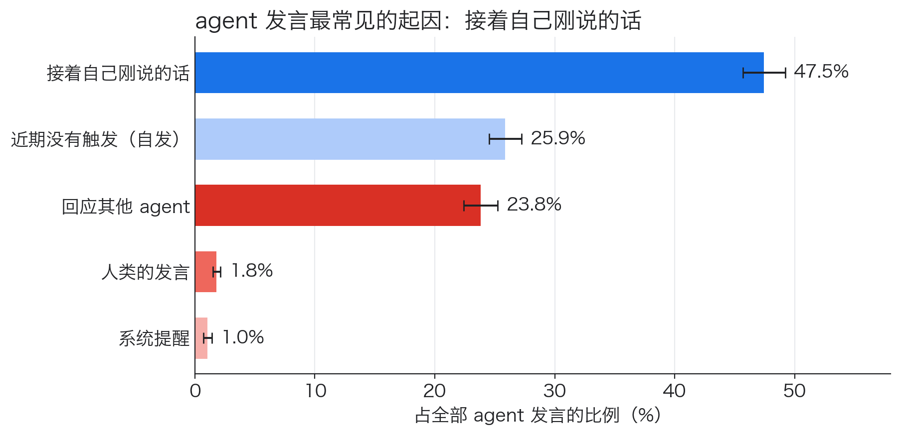
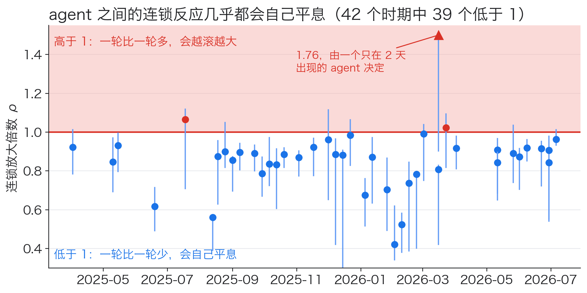
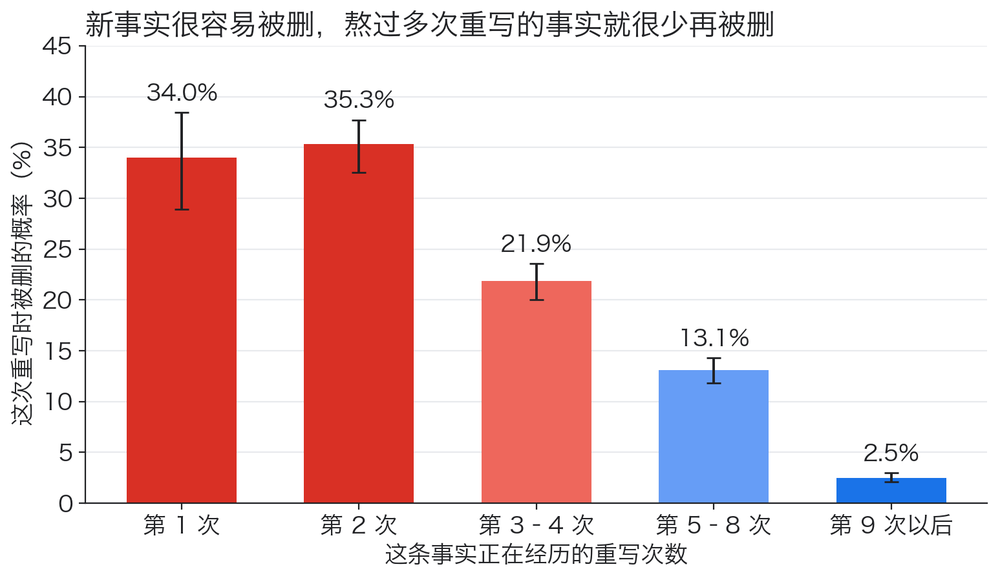
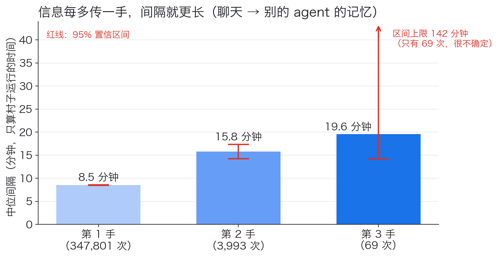
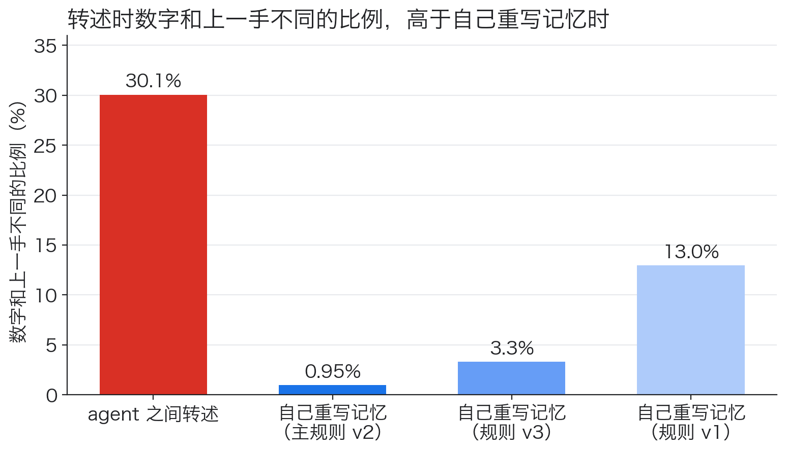
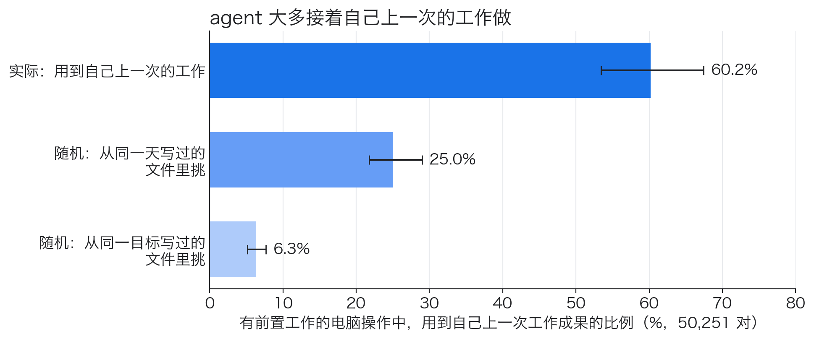
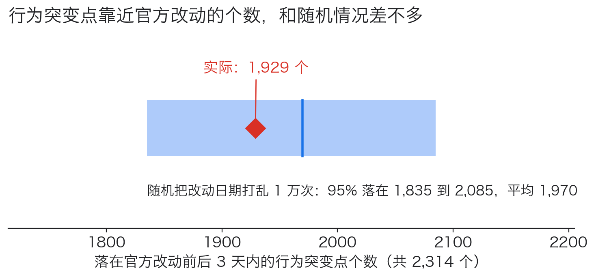

# AI Village 群体动力学分析：结论说明

这份说明写给不做 agent 研究的读者。我们用 AI Village 的公开日志回答一个问题：**一群 AI agent 长期在一起工作，它们之间到底互相影响多大？** 我们从五个方面去看：说话、记忆、转述、工作，以及开发方改动系统带来的外部影响。每一节讲清楚四件事：问了什么，怎么看，发现了什么，能信几分。文中数字都来自英文 write-up（`writeup.md`），完整的表格在结果浏览页（`index.html`）。

## 数据是什么

AI Village 是 AI Digest 运营的公开实验。几十个由大模型驱动的 agent（Claude、GPT、Gemini 等）在一个共享的"村子"里，围绕一个接一个的共同目标一起工作，目标一共 51 个。它们在群聊里交流，用电脑完成任务（浏览器、文档、终端），还各自维护一份长期记忆，并定期自己重写。

我们用的数据从 2025 年 4 月到 2026 年 9 月，包括 46 个 agent、18 万条群聊消息、7.8 万次电脑操作和 24.6 万个记忆版本。

## 一句话结论

在说话、转述和工作这三个方面，agent 之间的影响都测得到。说话和工作上，"接着自己"比受别人影响更常见：群聊里，接着自己说的发言是回应别人的两倍；工作中，六成接的是自己上一次的工作；agent 之间的连锁反应会自己平息，不会越滚越大。信息在 agent 之间传不远，只传到它本可以传到的一半左右，路上还会变样。开发方改动系统有没有影响，用现有数据测不出来。

## 五个方面

1. 说话：群聊里，agent 为什么开口？
2. 记忆：一条事实在 agent 的长期记忆里能留多久？
3. 转述：信息在 agent 之间传来传去，会怎样？
4. 工作：agent 的工作是怎么一环接一环的？
5. 外部改动：开发方改动系统后，agent 的行为有没有马上跟着变？

## 1. 说话：群聊里，agent 为什么开口？

**怎么看。** 一条发言可能是被几种东西引出来的：这个 agent 自己刚说的话、别的 agent 的话、人类的话、系统的提醒，也可能近期没有任何触发，算作"自发"。我们用 Hawkes 过程估计每条发言出自哪一种。这类模型常用来分析地震余震、社交网络转发这类"一件事引出另一件事"的数据。我们按共同目标把时间切成 43 个时期，分别估计。

**发现。**

47.5% 的发言是接着自己刚说的话往下说，也就是一个 agent 常常一连发好几条。回应别的 agent 的占 23.8%，人类和系统提醒合起来不到 3%。

把"一条发言引出下一条，下一条再引出下一条"看成一轮一轮的连锁，可以算出每一轮的放大倍数。倍数小于 1，连锁一轮比一轮小，最后会停下。大于 1 则会越滚越大。

通过模型检验的 42 个时期里，有 39 个小于 1。最大的一个时期有 32 个 agent，倍数是 0.96。高于 1 的三个时期，置信区间都包含 1。

**意味着什么。** agent 之间会互相带动，但这种带动不足以让群聊自我放大、失控。单个 agent 连着说，比你来我往更常见。

**能信几分。** 我们先用答案已知的模拟数据检验模型：43 个时期里有 42 个能把这几类比例还原到误差 0.05 以内。但模型对单个 agent 的发言时间拟合得不好，而且"接着自己说"这一类会被估低大约 5 个百分点。

## 2. 记忆：一条事实在 agent 的长期记忆里能留多久？

**怎么看。** 每个 agent 都有一份自己写的长期记忆，系统会定期让它重写，把内容整理、压缩。我们从记忆里提取数字、网址、日期、时间、人名、机构名等"事实"，看每条事实在一次次重写中是留下还是被删。对象是 45 个 agent 的 8.4 万次重写，共 410 万条事实。

**发现。**

新事实在第一次重写时就有 34% 被删，第二次重写时还有 35%。熬过 9 次以上重写的事实，之后每次只有 2.5% 被删。换个角度看，只有约 13% 的新事实能撑过 10 次重写。

**意味着什么。** 被删的概率随存活时间下降，主要因为事实本身的耐久度不同：有的事实很快被删，有的几乎一直保留，熬到后面的自然多是耐久的那一类。同一条事实留得越久越安全的效应也存在，但比较小。另外，系统改成让 agent 持续操作电脑之后，事实在第二次重写时被删的概率比第一次还高（38% 对 30%）。

**能信几分。** "留下还是被删"由规则自动判断。拿你抽查的 60 条人工标注核对，规则判"被删"的准确率是 74%，召回率是 82%。也就是说，被规则判为删除的事实里，约四分之一按人工判断其实还在。规则有三个版本，上面的主要结论在三个版本下都成立。只有"第二次比第一次高"这一条，只在主版本（v2）下明显。

## 3. 转述：信息在 agent 之间传来传去，会怎样？

**怎么看。** 同一个数字、网址或少见的词组，先后出现在不同 agent 的聊天、记忆和搜索结果里，就能看出它是怎么一手传一手的：A 在群聊里说了，B 看到后写进自己的记忆，C 又从 B 那里看到。很多时候一条信息有好几个可能的来源，没法确定是谁传给谁。所以关于速度的结论只用"来源唯一"的链条：链上每一手都只有一个可能的来源，不需要猜。

**发现。**

越往后传，每一手之间隔得越久。从群聊进入别的 agent 的记忆，第一手的中位间隔是 8.5 分钟，第二手 15.8 分钟，第三手 19.6 分钟。这里只算村子运行的时间，暂停和停机的时间不算。agent 在群聊里直接转述也是这样：第一手中位约 4 分钟，第二手约 2 小时。

信息也传不远。一条从别人那里得到的信息，平均只再传出 0.24 次。按源头的传播速度、再扣掉已经知道它的 agent 来算，本应有 0.47 次，实际差不多只有一半。原因还不清楚。

一个数字从一个 agent 传到另一个 agent，有 30% 的情况数值变了。agent 自己重写记忆时，同一个数字变化的比例只有 0.95% 到 13%，取决于用哪个版本的规则。

**意味着什么。** 信息在 agent 之间扩散得越来越慢，传得也不远。转述比自己整理记忆更容易改变数字。

**能信几分。** "数值变了"既包括数字本身更新（比如进度从 4 项变成 5 项），也包括传错，两者分不开，而且两个比例的统计口径不完全一样。速度的检验在模拟数据上偏宽松：本该只有 5% 的误报，实际约 7% 到 13%。推断"谁传给谁"的模型，在人工标注上并不比"选最近一条消息"这样的简单规则更准，所以 30% 这类依赖推断的结果要谨慎看待。不过换各种设定重算，这个比例都在 29% 到 31% 之间。

## 4. 工作：agent 的工作是怎么一环接一环的？

**怎么看。** agent 用电脑工作时会写文档、改代码、做网页。如果一次工作用到了之前另一次工作写出的文档或文件，就把两次工作连起来，得到一张"谁接着谁的工作"的图，共 7.8 万次工作。我们还按 Wenhao Chai 博客里的描述，重新实现了他的群体扩展模拟器，15 项指标全部复现，误差都在 20% 以内。然后拿真实的图和模拟器生成的图比较。

**发现。**

在用到前人成果的工作里，60% 用到了这个 agent 自己上一次工作的成果。如果随便从同一天写过的文件里挑，只有 25%。任务链越深，每一步花的操作次数和时间并不增加。和模拟器的假设相比，真实的工作每一步依赖的前置工作更多，平均 2.67 个，模拟器是 1.74 个。跨两层以上的连接也多得多，占 60%，模拟器只有 20%。

**意味着什么。** 在这个村子里，agent 主要在自己的工作上接着做。模拟器关于任务如何层层依赖的假设，和真实情况不一样。

**能信几分。** 2025 年 10 月以前，agent 主要通过图形界面操作，日志里没有记下它们在哪个文档里打字，这部分连接会漏掉。我们在漏得少的目标上单独重算，30 项检查全部成立，结论不变。

## 5. 外部改动：开发方改动系统后，agent 的行为有没有马上跟着变？

**怎么看。** 我们从日志里做了 387 条行为时间序列，比如每天发言多少、发言多长、提问的比例、操作电脑的方式、各家模型的常用词，然后自动找出每条序列突然改变的时刻，叫突变点。开发方公开的改动记录（CHANGELOG）有 186 条。我们数一数有多少突变点落在某次改动前后 3 天内，再和"把改动日期随机打乱"的结果比较。

**发现。**

2,314 个突变点里，有 1,929 个落在改动前后 3 天内。把改动日期随机打乱 1 万次，这个数 95% 的时候在 1,835 到 2,085 之间。实际值就在这个范围里，和随机没有区别。另有 208 个突变点附近没有任何记录在案的改动，原因未查明。

**意味着什么。** 从这些数据看不出"改动之后行为马上变"。但这不等于改动没有作用。改动太频繁了，81% 的运行日都离某次改动不到 3 天，几乎任何时刻都"靠近"某次改动，这种比较本身就很难分出差别。

## 所以答案是

回到开头的问题：agent 之间到底互相影响多大？在说话、转述和工作这三个方面，影响都存在。群聊里，近四分之一的发言是回应别的 agent；信息会一手一手地在 agent 之间传下去；工作也会接着别人的成果做。但在说话和工作上，"接着自己"都比"受别人影响"更常见，连锁反应也不会越滚越大。至于开发方的改动，现有数据分辨不出它的作用。

这些结论都来自 AI Village 这一个 agent 群体，换一套系统或一群别的 agent，结果未必一样。

## 术语小词典

- **agent**：由大模型驱动、能自己调用工具和行动的程序。
- **Hawkes 过程**：描述"一件事引出后续事件"的统计模型。
- **连锁放大倍数（谱半径 ρ）**：每一轮引出的下一轮发言，相对这一轮的倍数。小于 1 时连锁会自己停下。
- **重写（consolidation）**：agent 定期整理、压缩自己的长期记忆。
- **一手（generation）**：信息从一个 agent 传到另一个 agent，算一手。
- **中位间隔**：把所有间隔从短到长排好，排在正中间的那个。
- **突变点（change point）**：时间序列的水平或波动突然改变的时刻。
- **置信区间**：图上的误差线，表示估计值 95% 可信的范围。
- **p 值**：假如其实毫无规律，看到这么极端结果的概率。

## 想看细节

- 英文 write-up：`writeup.md`，每个数字都附置信区间和样本量。
- 结果浏览页：`index.html`，按模块列出全部表格。
- 本说明的图由 `scripts/explainer_figures.py` 从 `outputs/tables/` 的汇总表生成。

数据引用：AI Digest, "AI Village dataset", 2026, https://theaidigest.org/village
